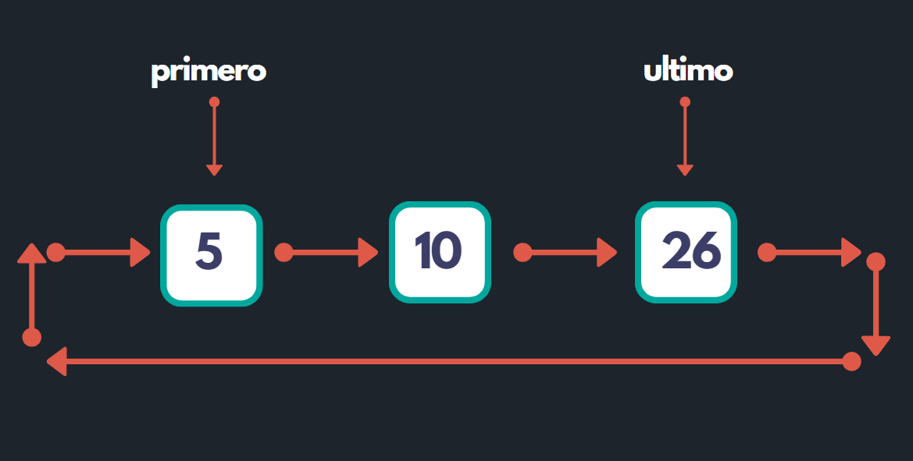

# Estructura de Datos

## Lista Circular Simple

En esta ocacion hemos realizado para nuestro repositorio de Github un ejemplo de como realizar la estructura de una lista Circular Simple esto hecho en el leguaje de C++ y en la cual hemos agregado las siguiente funciones

### Funciones

* Insertar al inicio 
* Insertar al final
* Elminar un nodo al inicio
* Eliminar un nodo al final
* Obtener el estado actual de la estructura
* Un metodo que nos permitar visualizar y recorrer nodo a nodo de esta estructura 

---
### Video Tutorial 

Aca podras encontrar los videos tutoriales de la explicacion del codigo que hemos realizado, la cual la hemos divido en dos partes y subido a nuestro canal de Youtube

[Parte 1](https://www.youtube.com/watch?v=PZE1op0tV4g&t=24s)

[Parte 2]()

---
### Serie de Estructura de Datos

Te dejamos un link para mires nuestra serie que hemos realizado sobre las diferentes estructuras de datos que tenemos en nuestro Canal 

[Serie](https://www.youtube.com/playlist?list=PLsNXwVWhLj8S5Vz--hFcWKL9fwMNB3M5b)

---

### Autor: DevTek

[Canal de Youtube](https://www.youtube.com/channel/UClawZxxlqfXzPetVvUnMb4g) :coffee:

